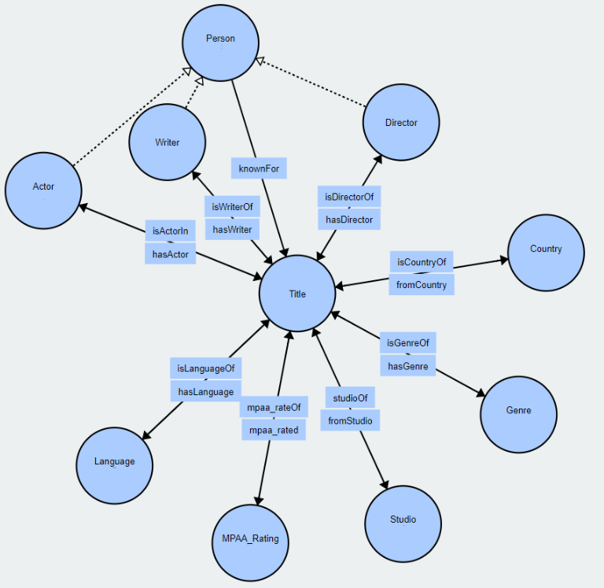
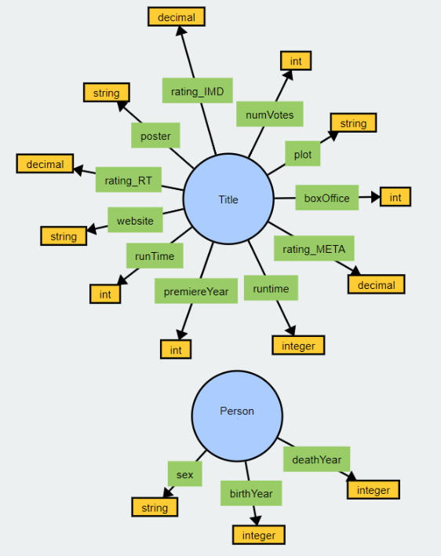
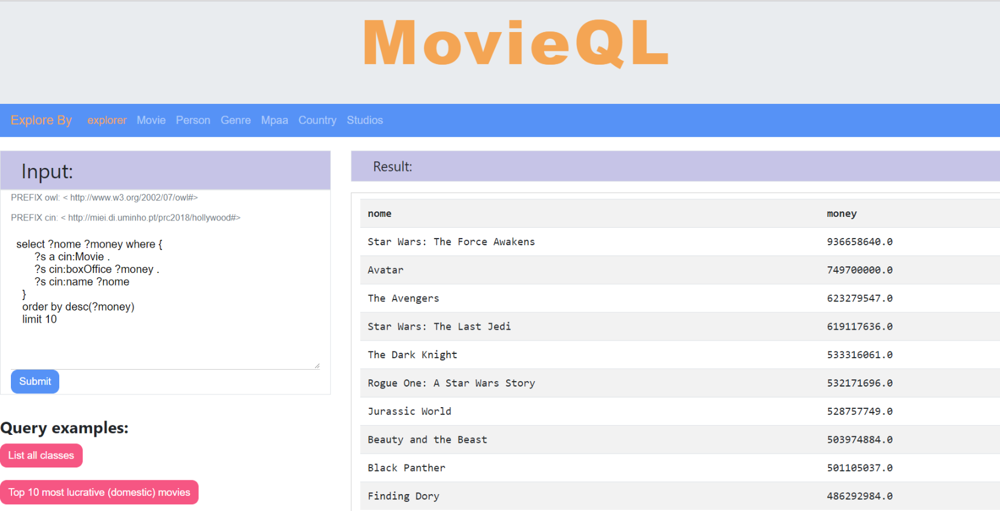
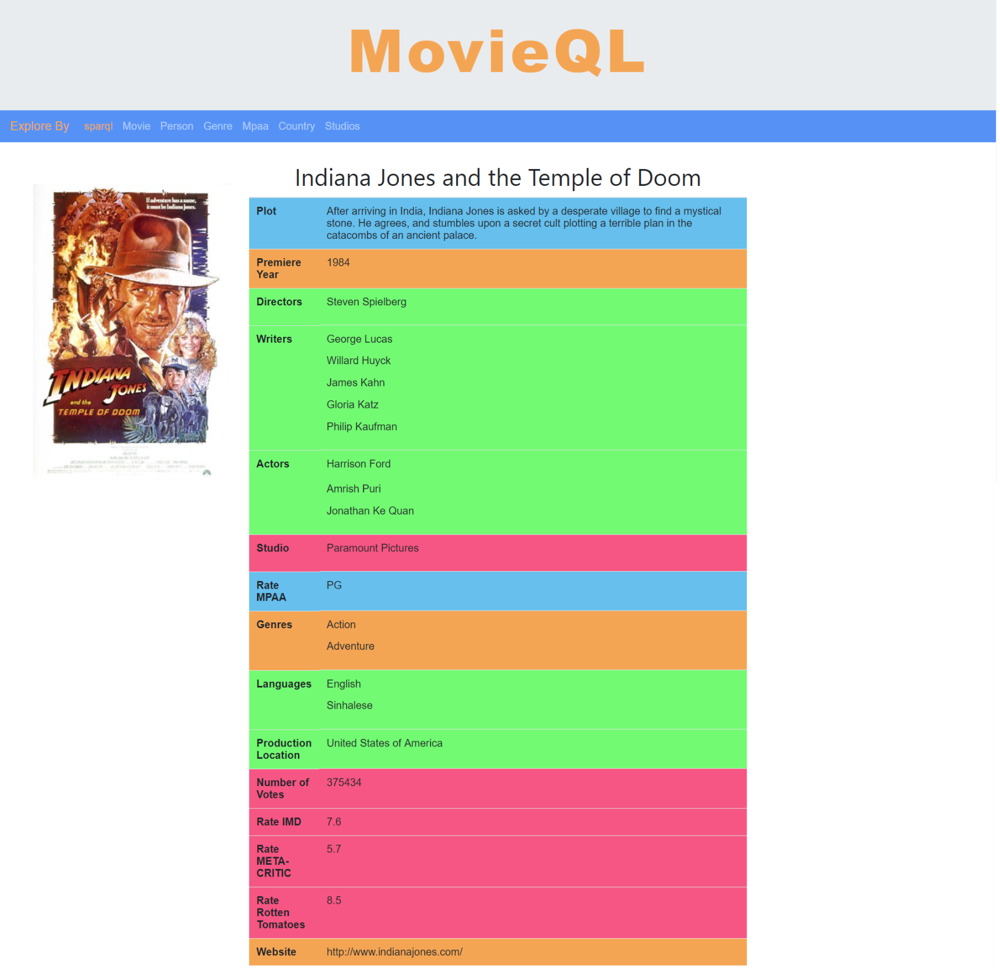

# MovieQL - Overview

Nodejs app where you can explore more than 7000 movies and 21000 people (actors, directors or writers). All information is stored in **OWL** format and [sparql-client 2  ](https://www.npmjs.com/package/sparql-client-2) is used to query the data in the ontology.
You have two ways to explore, querying in **SPARQL**, or explore interactively using search boxes for movie names, actor names, etc.

## 1) Ontology

#### 1.1) Ontology - Specifications

- **Topic**: Movies
- **Triples**: 381347
- **Individuals**: 29884
- **Classes**: 12
- **Object Properties**: 17
- **Data Properties**: 15 

#### 1.2) Ontology - Classes

- Country
- Genre
- Language
- MPAA_Rating
- Person
    - Actor
    - Composer
    - Director
    - Writer
- Studio
- Title
    - Movie

#### 1.3) Ontology - Object Properties

#### 1.4) Ontology - Data Properties

## 2) Nodejs App MovieQL

#### 2.1) App - Front Page

#### 2.2) App - Workbench
Query the ontology using **SPARQL** language

#### 2.3) App - Explore
Explore information about any movie

# Getting Started

## Prerequisites

- [NodeJs] - host app
- [GraphDB] - server to host ontology

## Installing

- Create new repository in graphDB
- import the ontology on this repository to the created GraphDb repository
- copy its repository URL to MovieQL>routes>sparql.js endpoint variable
- run nodejs server (npm start)
- go to localhost:3000

[NodeJs]: <https://nodejs.org/en/>
[GraphDB]: <http://graphdb.ontotext.com> 