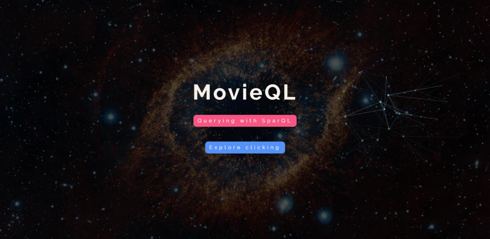

# MovieQL - Overview

Nodejs app where you can explore more than 7000 movies and 21000 people (actors, directors or writers). All information is stored in **OWL** format and [sparql-client 2  ](https://www.npmjs.com/package/sparql-client-2) is used to query the data in the ontology.
You have two ways to explore, querying in **SPARQL**, or explore interactively using search boxes for movie names, actor names, etc.

## 1) Ontology

### **Files**
**Ontology full**: [Ontology/cinema.owl](Ontology/cinema.owl)

**Ontology wihtout humans (only movies)**: [Ontology/cinema_withoutHumans.owl](Ontology/cinema_withoutHumans.owl)

#### 1.1) Ontology - Specifications

- **Topic**: Movies
- **Triples**: 381347
- **Individuals**: 29884
- **Classes**: 12
- **Object Properties**: 17
- **Data Properties**: 15 

#### 1.2) Ontology - Classes

- Country
- Genre
- Language
- MPAA_Rating
- Person
    - Actor
    - Composer
    - Director
    - Writer
- Studio
- Title
    - Movie

#### 1.3) Ontology - Object Properties


#### 1.4) Ontology - Data Properties


## 2) Nodejs App MovieQL

#### 2.1) App - Front Page


#### 2.2) App - Workbench
Query the ontology using **SPARQL** language


#### 2.3) App - Explore
Explore information about any movie


# Getting Started

## Prerequisites

- [NodeJs] - host app
- [GraphDB] - server to host ontology


## Installing
1. Configure and Launch DB
2. Start nodejs server

# 1. Configuring and Launch DB
### Install GraphDb desktop

1. Create free Account and request free version -> [link](https://www.ontotext.com/)
2. Install and Launch (the GraphDb interface should be available at http://localhost:7200)

### Create the repository
1. Create GraphDB repository (leave default configs)
2. Select your Repository
3. Import and select the `Ontology/cinema.owl` file
4. Select on left the `SPARQL` option (or http://localhost:7200/sparql) and try the following query

```
select ?s where {
    ?s a owl:Class .
}
```
you should get something like: These are all the classes
```
1 hollywood:Title
2 hollywood:Country
3 hollywood:Studio
4 hollywood:Actor
5 hollywood:Director
6 hollywood:Genre
7 hollywood:Language
8 hollywood:Writer
9 hollywood:Person
10 hollywood:MPAA_Rating
11 hollywood:Composer
12 hollywood:Movie
```

### Get the repository Url
Go to Setup > Repositories (or http://localhost:7200/repository) and copy the repository URL (anchor icon)

Should be something like this http://{USERNAME}:7200/repositories/{REPOSITORY_NAME}

# 2. Run Nodejs server
Replace the repository URL in `MovieQL>routes>sparql.js` 

> npm install

> npm start

> localhost:3000

# Acknowledgments

[Front Page] design from Rachel Smith

[WebSPARQL] José Carlos Ramalho


[NodeJs]: <https://nodejs.org/en/>
[GraphDB]: <http://graphdb.ontotext.com> 

[Front Page]:<https://tympanus.net/codrops/2014/09/23/animated-background-headers/>

[WebSPARQL]: <https://github.com/jcramalho/WebSPARQL>